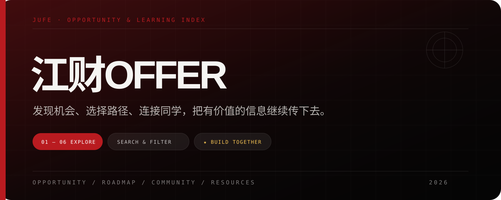
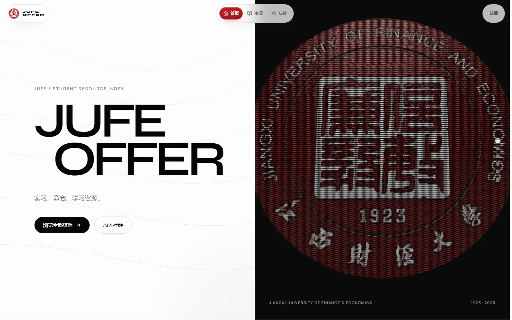
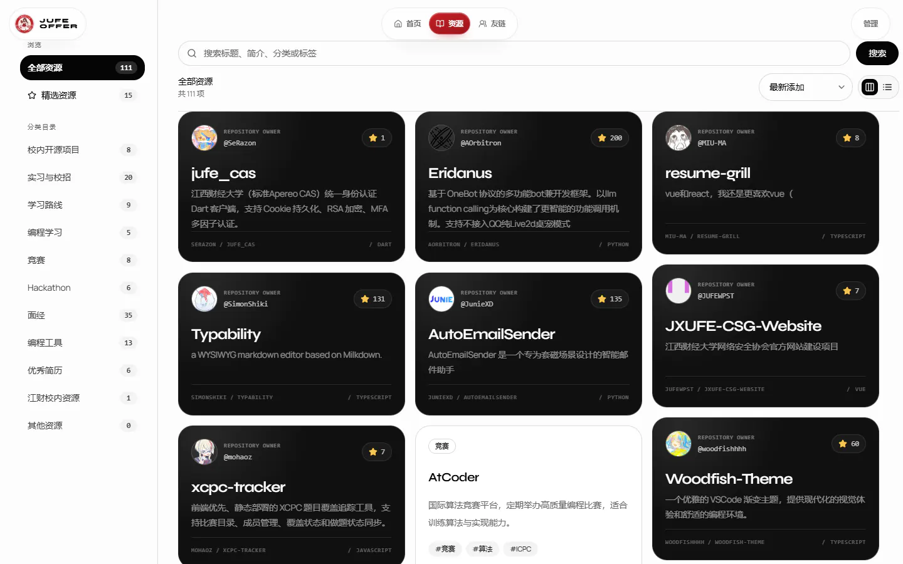
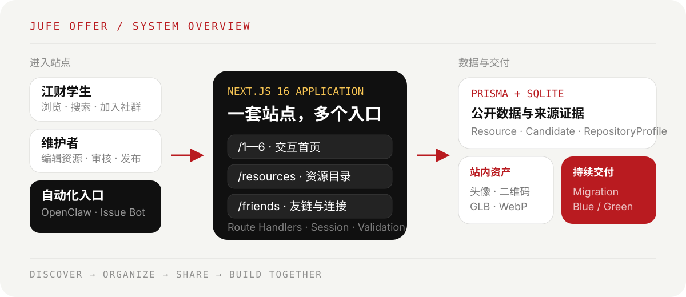

<p align="center">
  <picture>
    <source media="(max-width: 640px)" srcset="assets/readme/hero-mobile.svg" />
    
  </picture>
</p>

# 江财OFFER

一个把机会、学习路径、实用资源与同学连接集中起来的江财学生资源导航。

<p>
  <a href="https://jufe.woodfish.site/1"><strong>探索六页首页</strong></a>
  · <a href="https://jufe.woodfish.site/resources">浏览资源目录</a>
  · <a href="https://jufe.woodfish.site/friends">认识社区伙伴</a>
  · <a href="https://github.com/woodfishhhh/jufe-offer">参与共建</a>
</p>

> 江财OFFER 由学生自发维护，是非官方社区，不代表江西财经大学官方立场。

## 这是一个什么项目

<p align="center">
  
</p>

江财OFFER 希望把分散在群聊、文档、公众号和同学经验里的有效信息，整理成一个可以持续查找、验证与共同维护的入口。

- 用六页交互首页串联站点定位、社群、职业方向、校内开源、资源索引与开放共建。
- 用资源目录统一承载招聘、学习、竞赛、开源、简历面试、校园服务和效率工具。
- 用数据库保存公开内容与来源证据，让页面展示、后台管理和自动化投稿共享同一份权威数据。
- 用站内化图片、渐进增强和 blue/green 部署，兼顾访问速度、降级可用性与稳定发布。

## 六页首页

| 页面 | 主题     | 你可以做什么                                  |
| ---- | -------- | --------------------------------------------- |
| 01   | 资源入口 | 了解站点定位，开始浏览资源或加入社群          |
| 02   | 社群连接 | 找到 QQ 群，与同学交换信息和经验              |
| 03   | 职业地图 | 浏览职业方向、技术栈和完整学习路线            |
| 04   | 校内开源 | 发现同学的仓库，通过 Issue、PR 或投稿参与项目 |
| 05   | 资源索引 | 搜索、分类和筛选站内资源                      |
| 06   | 开放共建 | 访问项目仓库、查看 Star，并加入维护者行列     |

首页的视觉增强遵循渐进式策略：普通 DOM 内容始终可用；HTML-in-Canvas、Three.js 等效果只在浏览器和设备能力允许时启用。

## 资源目录

<p align="center">
  
</p>

资源页把不同来源的内容组织成可搜索的统一目录，支持分类、排序、精选筛选和管理员维护。校内开源项目也是其中一个分类：首页第 4 页和资源页复用数据库记录与同一套仓库卡片，展示仓库名、Description、Star、主语言及 owner 或投稿贡献者头像。

## 系统如何工作

<p align="center">
  <picture>
    <source media="(max-width: 640px)" srcset="assets/readme/system-overview-mobile.svg" />
    
  </picture>
</p>

Resource 是公开资源的权威记录，Candidate 保留自动入库过程与来源证据，RepositoryProfile 保存 GitHub 仓库展示资料。页面、管理后台、OpenClaw 和 Issue Bot 最终都通过同一数据层协作，避免静态名单与数据库状态不一致。

## 技术构成

| 层     | 选择                                                        |
| ------ | ----------------------------------------------------------- |
| Web    | Next.js 16 App Router、React 19、TypeScript                 |
| UI     | Tailwind CSS、Motion、GSAP、Three.js                        |
| 数据   | Prisma ORM、SQLite、Zod                                     |
| 自动化 | GitHub Actions、OpenClaw、Issue Bot、仓库资料与头像同步工具 |
| 部署   | Next.js standalone、systemd blue/green、Nginx               |

## 快速开始

需要 Node.js 24 和 pnpm。Windows PowerShell：

```powershell
pnpm install
Copy-Item .env.example .env
pnpm db:generate
pnpm prisma migrate deploy
pnpm db:seed
pnpm dev
```

打开 <http://localhost:3000>。pnpm db:seed 只用于初始化演示数据；已有真实数据时不要重复覆盖。

### 环境变量

最小本地配置：

```env
DATABASE_URL="file:./dev.db"
ADMIN_USERNAME=admin
ADMIN_PASSWORD_HASH=
SESSION_SECRET=
OPENCLAW_INGEST_TOKEN=
NEXT_PUBLIC_SITE_URL=http://localhost:3000
```

生成随机密钥：

```bash
node -e "console.log(require('crypto').randomBytes(32).toString('hex'))"
```

生成管理员密码哈希：

```bash
pnpm hash-password -- 你的密码
```

推荐把命令输出的 hex 值写入 ADMIN_PASSWORD_HASH。如果直接使用 bcrypt 字符串，需要把每个 $ 写成 $$，避免被 Next.js 当成环境变量展开。

SQLite 默认位于 prisma/dev.db，因为 DATABASE_URL="file:./dev.db" 相对 prisma/ 目录解析。完整字段及说明见 [.env.example](.env.example)。

## 日常开发

```bash
pnpm lint
pnpm typecheck
pnpm test:friend-links
pnpm build
```

数据库结构变化后运行 pnpm db:migrate；生产环境只执行已有 migration：

```bash
pnpm prisma migrate deploy
```

## 维护与自动化

### 管理资源

普通方式是在资源页登录管理员账号。登录后可以新增、编辑和删除资源；所有写操作都会在服务端再次验证管理员会话，退出后权限立即失效。

#### 让本机管理线上资源

本项目支持“本机后台 → 本机 Next.js 服务端 → 线上资源 API”的受控代理。它不会开放 SQLite 文件、SSH 或任意系统权限，也不会把管理 Token 发送到浏览器。

本机 .env.local：

```env
USE_REMOTE_RESOURCES=true
REMOTE_RESOURCE_API_BASE_URL=https://jufe.woodfish.site
RESOURCE_ADMIN_API_TOKEN=至少32字符的独立随机Token
```

线上服务器 /opt/jufe-offer/.env 必须配置同一份 RESOURCE_ADMIN_API_TOKEN 并重启当前应用 slot。完成后，在本机站点使用管理员账号登录，资源页的增删改会由本机服务端代理到线上；列表读取也来自线上。

安全边界：

- RESOURCE_ADMIN_API_TOKEN 只能存在于服务端环境，绝不能使用 NEXT_PUBLIC_ 前缀。
- 它只授权 /api/resources 的增删改查，不授权其他集成接口。
- 本机浏览器的 Cookie 或 Authorization 不会原样转发；代理会替换为服务端 Token。
- SESSION_SECRET、管理员密码、OPENCLAW_INGEST_TOKEN 与该 Token 必须分别生成，不能复用。
- 未配置 Token 时，远程写请求返回 HTTP 503；Token 错误时线上返回 HTTP 401。

<details>
<summary><strong>OpenClaw 自动入库</strong></summary>

OpenClaw 使用独立 Bearer Token：

```text
POST /api/integrations/openclaw/candidates
Authorization: Bearer <OPENCLAW_INGEST_TOKEN>
Content-Type: application/json
```

请求会先保存完整 Candidate，再在同一事务中建立 Resource 并标记为 APPROVED。相同 dedupeKey 或相同正式资源 URL 不会重复发布；已完成状态不能被覆盖。正式资源继续保留 SEED、MANUAL 或 OPENCLAW 来源字段，但公开页面不依赖来源标签区分资源。

接口使用 strict schema、64 KiB 请求体上限、HTTPS 链接限制和单实例每分钟 60 次速率限制。允许分类与请求结构以 [src/schemas/candidate.ts](src/schemas/candidate.ts) 为准。

</details>

<details>
<summary><strong>校内开源项目投稿与头像同步</strong></summary>

资源页“校内开源项目”分类顶部的“提交自己的项目”会打开 GitHub Issue。机器人会：

1. 校验仓库地址、项目信息和本校同学创立或参与的声明。
2. 读取 GitHub 仓库名、Description、Star 和主语言。
3. 优先使用参与开发的 Issue 投稿者头像，否则使用仓库 owner 头像。
4. 将头像裁剪压缩为 320×320 WebP，保存到 public/campus-project-avatars/。
5. 生成带重复 URL 防护的 Prisma migration，由 CI/CD 迁移并部署。

手动刷新全部仓库资料与头像：

```bash
pnpm sync:campus-projects
```

也可以只同步指定仓库：

```bash
pnpm sync:campus-projects -- https://github.com/owner/repository
```

旧命令 pnpm sync:campus-project-avatars 仍作为兼容别名保留。

</details>

<details>
<summary><strong>生产部署与 SQLite 备份</strong></summary>

.github/workflows/ci-deploy.yml 在 Pull Request 上执行 lint、类型检查和生产构建；main 更新后部署到京东云。生产采用 standalone blue/green release：候选 slot 通过 revision health 后才切换 Nginx，上一个 release 保留用于恢复。

Migration 变化默认进入 maintenance：停止活动应用、checkpoint WAL、使用 SQLite .backup 建立一致快照、执行 migration，再启动候选版本。人工确认新旧 schema 兼容后，才可在 workflow dispatch 选择 compatible。

服务器 /opt/jufe-offer/.env 和 SQLite 数据库不进入构建产物。完整拓扑、权限、切流与失败恢复流程见 [deploy/README.md](deploy/README.md)。

手动备份示例：

```bash
mkdir -p backups
cp prisma/dev.db "backups/dev-$(date +%Y%m%d).db"
```

Windows PowerShell：

```powershell
New-Item -ItemType Directory -Force backups | Out-Null
Copy-Item prisma/dev.db "backups/dev-$(Get-Date -Format yyyyMMdd).db"
```

</details>

## 内容维护

- 资源分类：修改 [src/data/categories.ts](src/data/categories.ts) 的 CATEGORY_VALUES。
- 友链：修改 [src/data/friends.ts](src/data/friends.ts)；友链申请由 Issue Bot 定时核验反向链接。
- 站点信息、QQ群号与二维码：修改 [src/data/site.ts](src/data/site.ts) 及对应 public/ 资产。
- 仓库头像同步工具：[scripts/campus-project-avatars.ts](scripts/campus-project-avatars.ts)。
- 投稿与友链机器人：[scripts/friend-link-bot.ts](scripts/friend-link-bot.ts)。

## 项目结构

```text
src/app/                 页面与 API Route Handlers
src/components/          首页、资源页与共享 UI
src/lib/                 Prisma、鉴权、远程资源代理与数据映射
prisma/                  schema、seed 与可追踪 migrations
scripts/                 投稿机器人、头像同步与维护工具
public/                  站内图片、模型与压缩头像
deploy/                  blue/green 部署脚本和运维说明
assets/readme/           README 的 SVG 与压缩实机截图
```

## 参与共建

欢迎通过 [Issue](https://github.com/woodfishhhh/jufe-offer/issues) 提交建议和资源，通过 [Pull Request](https://github.com/woodfishhhh/jufe-offer/pulls) 改进页面与代码。校内开源项目可以使用[专用投稿模板](https://github.com/woodfishhhh/jufe-offer/issues/new?template=open-source-project.yml)。
